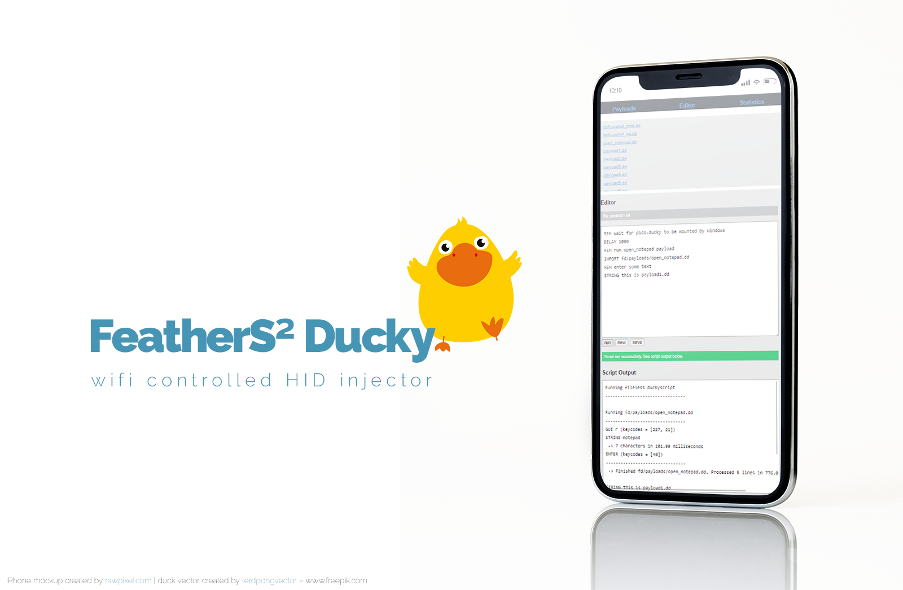
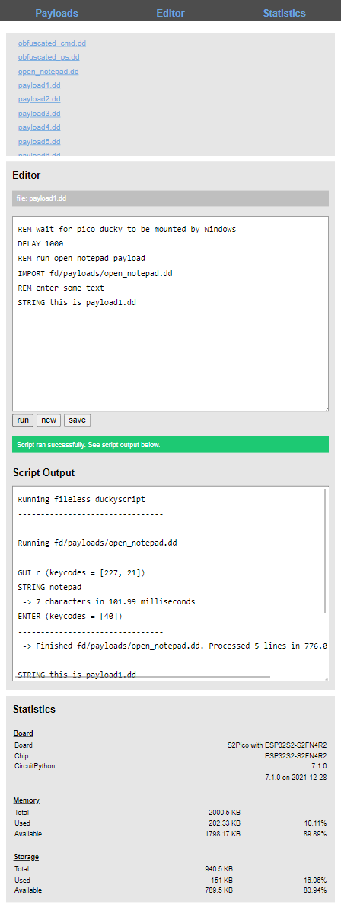

<h1 align="center"> </h1>

  <strong>Wifi controlled USB Rubber Ducky on a FeatherS2 board</strong>

 

  
  
  
  
  

 

**USB Rubber Ducky for FeatherS2 boards - controlled via Wifi**

This implementation is based on [my fork](https://github.com/andreasbrett/pico-ducky) of the awesome [pico-ducky by dbisu](https://github.com/dbisu/pico-ducky).

Main Features

-   inject keyboard actions
-   inject mouse clicks, movements, scrolls
-   inject media key commands (play, pause, mute...)
-   dynamically control injection through a dedicated Wifi Hotspot that is spawned by the feathers2ducky
-   display state information through the onboard display
-   display debugging information through the serial output (see [Mu Editor](https://codewith.mu/en/about))
-   use debugging information to analyze timings of your scripts

The code in this repo is tested to work with the [Lolin S2 Pico](https://circuitpython.org/board/lolin_s2_pico/). It should also work with the [Lolin S2 Mini](https://circuitpython.org/board/lolin_s2_mini/) if you disable the display through the configuration.

Check out what [modifications](#mods) this fork provides.

## Installation

Install and have your USB Rubber Ducky working in just a couple of minutes.

1. Download latest version of [CircuitPython for the Lolin S2 Pico](https://circuitpython.org/board/lolin_s2_pico/) (min. 7.1.0)
2. Plug the device into a USB port. Press the Reset button, then within a second hit the boot button. It will show up as a removable media device.
3. Copy the downloaded `.uf2` file to the root of the FeatherS2 drive. It will reboot shortly after and reconnect as `CIRCUITPY`.
4. Download `adafruit-circuitpython-bundle-7.x-mpy-YYYYMMDD.zip` [here](https://github.com/adafruit/Adafruit_CircuitPython_Bundle/releases/latest) and extract it outside of the device.
    - Navigate to `lib` of the recently extracted folder
    - Copy the folders `adafruit_hid` and `adafruit_display_text` to the `lib` folder on your FeatherS2.
5. Download `adafruit-circuitpython-displayio-ssd1306-7.x-mpy-x.x.x.zip` [here](https://github.com/adafruit/Adafruit_CircuitPython_DisplayIO_SSD1306/releases/latest) and extract it outside of the device.
    - Navigate to `lib` of the recently extracted folder
    - Copy the file `adafruit_displayio_ssd1306.mpy` to the `lib` folder on your FeatherS2.
6. Download `ampule.py` [here](https://github.com/deckerego/ampule/blob/main/ampule.py) and copy it to the `lib`folder on your FeatherS2.
7. From this repo:
    - place `boot.py`, `main.py` to the root of your FeatherS2
    - copy the `fd` folder to the root of your FeatherS2
8. Unplug and re-plug the FeatherS2 so it will reconnect as `_` (this drive label can be configured) and reboot into [web-server mode](#webserver_mode).
9. Connect to the spawned Wifi Hotspot **FeatherS2Ducky** using password `feathers2ducky`
10. Navigate to `http://192.168.4.1` and authenticate with user `feather` and password `ducky` to control your feathers2ducky.

### Configuration

Many of the feathers2ducky settings can be configured. If you want to change the default settings use template `fd\config_default.py` and save a modified version with your changes as `fd\config.py`.

You can heavily customize your feathers2ducky here by e.g.

-   enabling or disabling HTTP authentication for the web interface (you definitely want that on when it's connected to an existing Wifi)
-   changing its MAC address
-   changing the Wifi channel to reduce interference
-   letting it connect to an existing Wifi rather than spawning a hotspot
-   disabling the Wifi feature altogether turning it into a plain USB rubber ducky

The [configuration file](fd/config_default.py) is thoroughly documented through comments for each parameter. Instead of documenting this here, I opted to document it where it would be needed in the first place.

### Changing Keyboard Layouts

To change the keyboard layout from the default DE keyboard, you will have to:

-   place the corresponding keyboard layout libraries onto the flash
-   configure the default layout through the "locale" setting of the configuration

1. go to https://github.com/Neradoc/Circuitpython_Keyboard_Layouts/releases/latest
2. check if the desired keyboard layout is included (if not: skip to step 6)
3. download the `circuitpython-keyboard-layouts-7.x-mpy-xxxxxxxx.zip`
4. copy the following files from the zip file to the `lib` folder on your feathers2ducky
    - `keyboard_layout.py`
    - `keyboard_layout_win_LANG.py` (replace LANG with your desired language)
    - `keycode_win_LANG.py` (replace LANG with your desired language)
5. go to step 7
6. (only if you came here from step 1) [make a keyboard layout](https://www.neradoc.me/layouts/)
7. define "locale" in your configuration or dynamically change the locale at runtime in your payload(s) through e.g. `LOCALE FR`

## Operation Modes

**Note:** To toggle between modes you will have to connect a specific pin to the ground pin (marked `GND` in the pinout diagram above). I will call this "grounding" throughout this documentation.

### Normal vs Stealth Mode

In normal mode the feathers2ducky will mount as a USB flash drive. This is great for creating your payloads or configuring the device but not very stealthy when using this in an attack scenario. To hide the feathers2ducky you have to ground pin `IO21`. It will then launch the so-called stealth mode upon boot and not show up as a flash drive.

**Note:** Feathers2ducky has to be in stealth mode if you want to write payloads to the flash via the web interface (this is a limitation of CircuitPython).

### Inject at boot

The feathers2ducky can automatically run a payload/duckyscript when plugged into the target machine. Ground any of the pins `IO11`/`IO12`/`IO13`/`IO14`/`IO15`/`IO16` to define the autorun payload slot. By default payload slots 1-6 run the payloads `fd\payloads\payload1.dd`, `fd\payloads\payload2.dd` and so on.

You can customize which slot runs which payload file through the configuration file. Copy `fd\config_default.py` to `fd\config.py` and change the settings in the `payloads` section. Once the script is injected the script will boot into [web-server mode](webserver_mode).

**Note:** If you don't ground any of these 6 pins the feathers2ducky will directly boot into [web-server mode](#webserver_mode).

### Mouse Jiggler Mode

If you ground pin `IO17` the feathers2ducky will boot into mouse jiggler mode and slightly jiggle the mouse every now and then. This will prevent the target machine from entering screensaver mode / locking itself. Parameters for this mode can be configured in the `mouseJiggler` section of the configuration. Defaults are:

-   jiggle every 1-15 seconds (random!)
-   move the mouse 10px up+left and back down+right again
-   mouse jiggler mode is indicated
    -   through blinking the LED 6x shortly upon boot
    -   through blinking the LED 1x for each movement

### Web-Server Mode

If no payload was injected at boot or the feather2ducky hasn't been set to [mouse jiggler mode](#mousejiggler_mode) it will boot into webserver mode. By default it will spawn a Wifi hotspot `FeatherS2Ducky` (default password: `feathers2ducky`) that you can connect to via e.g. smartphone giving you control over the feathers2ducky. The web interface will let you run, modify and save an existing payload on the flash or let you create new payloads. Great for dynamically and contextually injecting payloads onto your target machine.

You could e.g. plant the feathers2ducky behind the monitor in one of the monitor's USB slots then wait for the victim to unlock the computer and also the perfect moment of distraction to inject your payload undetected (victim unlocks computer, then talks to a co-worker).

**Note:** In order to save/create payloads the feathers2ducky will have to be in [stealth mode](#stealth_mode). If the flash is mounted as a drive on the target machine, only the target machine can write to the flash - however not feathers2ducky itself.

## Differences of this fork to dbisu's feather-ducky

Apart from major refactoring, additions to the original code are as follows:

-   support for FeatherS2 boards with attached display (e.g. [Lolin S2 Pico](https://circuitpython.org/board/lolin_s2_pico/))
-   introduced new commands to the Ducky Script language (see below)
-   beautified serial output
    -   easier to debug, better to analyze scripts
    -   performance of scripts is now measured
    -   it's easy to compare how much enabling e.g. `PSYCHOMOUSE` mode affects performance (spoiler: roughly 15-20%)
-   separate configuration file to customize your feathers2ducky
    -   many hard-coded settings of the original feathers2ducky can now be configured
    -   use template `fd\config_default.py` and store it as `fd\config.py` for custom settings
-   allows running one of 6 different payloads (by grounding pins `IO11`, `IO12`, `IO13`, `IO14`, `IO15` or `IO16`)
-   allows running a mouse jiggler when grounding `IO17` (see Hak5 presentation: https://www.youtube.com/watch?v=aZ8u56I3J3I)
-   includes some basic duckyscripts to get you started in folder `fd`

### Changes to the Ducky Script language

-   let duckyscript wait for presence of a Wifi Access Point through e.g. `WAITFORWIFI MyPhoneHotspot`
    -   instead of running the payload immediately upon connecting the ducky, trigger it actively by spawning a Wifi hotspot from your phone
    -   perfectly time injections
-   importing other payloads through e.g. `IMPORT filename.dd`
-   setting keyboard locale **at runtime** through e.g. `LOCALE DE` (which would load `keyboard_layout_win_de` and `keycode_win_de` from the libs folder).
-   type a string and finalize with a carriage return (ENTER)
    -   `STRINGLN some text with a carriage return at the end`
-   wait for keyboard LED to be on or off
    -   `WAITFORLED CAPS_LOCK ON`
    -   `WAITFORLED NUM_LOCK OFF`
    -   `WAITFORLED SCROLL_LOCK ON`
    -   `WAITFORLED COMPOSE ON`
    -   LED states are polled every 100ms, so also quick key presses are caught
    -   great to build trigger patterns (e.g. NUM on, NUM off, CAPS on, CAPS off)
-   blinking LED through e.g.
    -   `BLINK_LED` (blink once with default duration)
    -   `BLINK_LED 250` (blink once for 250ms)
    -   `BLINK_LED 500 3` (blink 3x for 500ms)
-   all F-keys can be sent (so also F13-F24)
-   added commands
    -   `RIGHTALT`
    -   `RIGHTCONTROL`
    -   `RIGHTGUI`
    -   `RIGHTSHIFT`
    -   `POWER` (specific to MacOS)
-   sending consumer control commands (aka media keys)
    -   `CC SEND BRIGHTNESS_DECREMENT`
    -   `CC SEND BRIGHTNESS_INCREMENT`
    -   `CC SEND EJECT`
    -   `CC SEND FAST_FORWARD`
    -   `CC SEND MUTE`
    -   `CC SEND PLAY_PAUSE`
    -   `CC SEND RECORD`
    -   `CC SEND REWIND`
    -   `CC SEND SCAN_NEXT_TRACK`
    -   `CC SEND SCAN_PREVIOUS_TRACK`
    -   `CC SEND STOP`
    -   `CC SEND VOLUME_DECREMENT`
    -   `CC SEND VOLUME_INCREMENT`
    -   to press and later release a media key use the following commands (only one can be pressed at a time!)
        -   `CC PRESS VOLUME_INCREMENT`
        -   `CC RELEASE`
-   sending mouse commands (movements, scrollwheel action, clicks, presses and releases)
    -   `MOUSE MOVE $x $y` - moves the mouse pointer
    -   `MOUSE WHEEL $amount` - moves the mouse wheel (negative = toward the user, positive = away from the user)
    -   `MOUSE CLICK/PRESS/RELEASE LEFT [RIGHT] [MIDDLE]` - click, press or release one ore more buttons
        -   `MOUSE CLICK RIGHT` presses and immediately releases the right button
        -   `MOUSE PRESS LEFT RIGHT` keeps the left and right buttons pressed
        -   `MOUSE RELEASE LEFT RIGHT` releases them again
    -   `MOUSE RELEASEALL` - releases all pressed buttons
    -   these work great in scenarios where you want to mess with user's ability to e.g. close your shell by moving the mouse or to spookily move the mouse around ever so often
-   activating <strong>psycho-mouse</strong> mode through `PSYCHOMOUSE [CHARS] [RANGE]`
    -   this mode will randomly move the mouse when issuing a `STRING $yourstring` command
    -   user won't be able to close your shell by mouse (we all know lusers don't know keyboard shortcuts)
    -   `PSYCHOMOUSE` will activate psycho-mouse mode with default values (chars = 5, range = 250)
    -   `PSYCHOMOUSE 12 300` moves mouse every 12 chars in a range of +/- 300 pixels
    -   `PSYCHOMOUSE OFF` disables psycho-mouse mode
    -   <strong>note:</strong> typing performance reduces by roughly 15-20% with the default values

## Thanks and appreciations

Thanks to [dbisu](https://github.com/dbisu) and his awesome [pico-ducky](https://github.com/dbisu/pico-ducky) and [feathers2-ducky](https://github.com/dbisu/feathers2-ducky) projects that this is heavily based on.

Thanks to [John Ellis](https://github.com/deckerego) for his tiny webserver for CircuitPython [ampule](https://github.com/deckerego/ampule).

Thanks to [Jim Bennett](https://github.com/jimbobbennett) for his [UrlParse library for CircuitPython](https://github.com/jimbobbennett/CircuitPython_Parse). I have [extracted some code](fd/unquote.py) from it to urldecode HTTP POST payloads.

## More info and the USB Rubber Ducky, Duckyscript and the Pico-Ducky

[pico-ducky tutorial by **NetworkChuck**](https://www.youtube.com/watch?v=e_f9p-_JWZw)

[USB Rubber Ducky playlist by **Hak5**](https://www.youtube.com/playlist?list=PLW5y1tjAOzI0YaJslcjcI4zKI366tMBYk)

[Ducky Script manual](https://github.com/hak5darren/USB-Rubber-Ducky/wiki/Duckyscript) (without the [mods](#mods_duckyscript) introduced with this fork)

[Mouse Jiggler as presented by **Hak5**](https://www.youtube.com/watch?v=aZ8u56I3J3I)

[**Hak5**'s CircuitPython Rubber Ducky](https://www.youtube.com/watch?v=HKdLJapPD1c) (technical)
